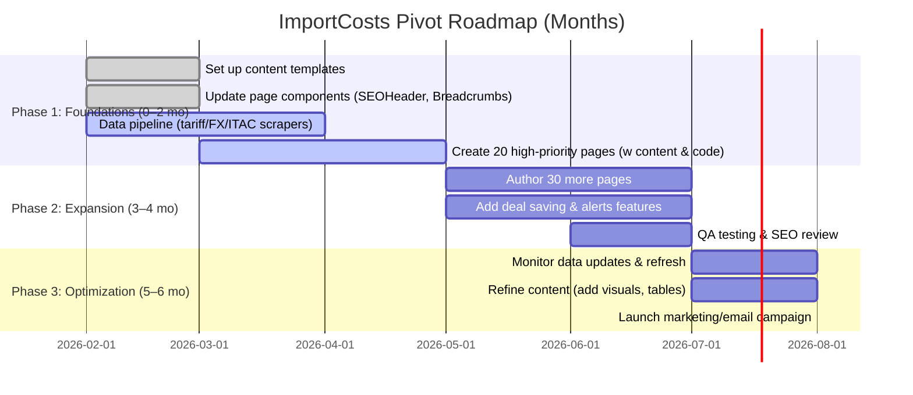

# Executive Summary  
We audited the existing **ImportCosts** pSEO pages (China→SA tariff calculator) and recommend pivoting to an *“Importer Decision”* content-first model. Currently the site has two page templates under **src/app/import-duty-vat-landed-cost/**:  

- **Product pages** (`/[clusterSlug]/from/[origin]/to/south-africa`): e.g. *Import Duty & VAT for Solar Panels from China*. These load a default SAR 10K scenario and embed the calculator (via `StoreHydrator` and `ResultsPanel`【14†L75-L84】【14†L98-L107】), but contain only a dynamic H1 and brief intro (generated by `SEOPageHeader`【22†L130-L137】) plus FAQs and internal links.  
- **HS-code pages** (`/hs/[hs6]/from/[origin]/to/south-africa`): e.g. *Import Duty for HS 847130 (Speedometers)*. Similar structure, with dynamic intro and SEO header【22†L129-L137】.  

Neither page offers substantive static content: both rely on the interactive calculator UI. 

**Mapping to Decision-JTBDs:** Product pages serve as a “Deal Viability” overview (profitability check), while HS pages can address “Risk Radar” (classification/AD issues) and specificity. *Missing tools:* There are no explicit modules for structured scenario comparison, cashflow timing, or compliance planning. No page currently provides a clear step‐by‐step import checklist or risk summary in business terms, nor a mechanism to save/watch deals.

**Gaps:** We need to enrich each page into a **standalone decision-support product**. That means adding contextual copy, example scenarios, risk bullets, checklists and clear CTAs. For example, product pages should go beyond “calc duties” to say “At R\[X\]/unit your margin is Y% – that’s tight given category norms,” and HS pages should warn of AD duties or testing requirements. 

Below we outline a new content strategy: 

---

## 1. Page Inventory (pSEO Templates)  

| Path Pattern | Page Type | Purpose | Key Inputs & Widgets | Static Content (H1/Intro) |
|-------------|-----------|---------|----------------------|---------------------------|
| `/import-duty-vat-landed-cost/[clusterSlug]/from/[origin]/to/south-africa` | **Product (cluster) page** | Calculates landed cost for a named product category (clusterSlug) from given origin (e.g. China)【14†L75-L84】. | Inputs: inferred best HS code (via DB), currency, invoice, freight, etc. Widgets: SEO header (dynamic H1 & intro)【22†L130-L137】; StoreHydrator+ResultsPanel (interactive calc)【14†L98-L107】; Related links grid; FAQ. | H1: “Import Duty & VAT Calculator: *Product* from *Origin* to South Africa.” Intro: ~1–2 sentences explaining what’s being calculated (customizable by product)【22†L130-L137】. Minimal unique body copy. |
| `/import-duty-vat-landed-cost/hs/[hs6]/from/[origin]/to/south-africa` | **HS Code page** | Calculates landed cost by HS code for goods from origin. Useful for importers who know HS 6-digit code. | Inputs: HS6 (path), invoice, freight, etc. Widgets: same pipeline as above (SEO header, calculator, FAQ)【22†L129-L137】. | H1: “Import Duty Calculator: HS *hs6* from *Origin* to South Africa.” Intro: 1–2 sentences about calculating duty for that HS code. |

Each page currently has only ~50–100 words of custom text (the intro)【22†L130-L137】, plus autogenerated FAQ text. All critical info (duty %, VAT formula, etc.) comes from the calculator logic or FAQs, not substantive copy.  

**Embedded widgets:** Both types embed the calculation UI (via `<StoreHydrator>` and `<ResultsPanel>`【14†L98-L107】), plus breadcrumbs, trust badges, and a FAQ section. There is no “Deal Viability summary” or “risk checklist” in narrative form – these must be added.  

---

## 2. JTBD Mapping & Gaps  

**Deal Viability:** *Product pages* should directly answer “Is this deal profitable?” by summarising margins under current assumptions.  
**Structuring (What-if):** We need a “Scenario Comparer” allowing multiple inputs (FOB vs CIF, qty changes) – not currently surfaced as content.  
**Risk Radar:** Both page types must highlight “margin killers”: e.g. classification uncertainty, anti-dumping duties, freight delays. The site’s `risk_flags` object (empty in pSEO now【14†L129-L137】) could feed this.  
**Readiness Plan:** A clear import checklist (documents, tests) by product/HS. Currently only generic items from preference declarations appear【6†L121-L130】.  
**Cash/Timeline:** We should show cashflow impact (e.g. deposit now vs payment later, lead times) – none exists.  
**Watchlist/Alerts:** Prompt to “save deal and get alerts” (not currently implemented on pages).

*Gap analysis:* Every page needs rewriting to be a **decision guide**. For example, product page “Import solar panels” should say: *“At ZARX per unit landed, your gross margin is Y%. This is low compared to typical solar margins (~20–30%), so consider  larger volume or negotiation.”* Currently it just shows the calculator. Similarly, HS pages need notes on common compliance rules (e.g. “Speedometers require NRCS LOA under SANS standard【6†L113-L120】”). 

We must inject concrete scenarios (at least 3) per page, not just a single default. Also add a checklist (e.g. documents, tests). CTAs like “Save this deal” or “Compare routes” should replace passive boilerplate.

---

## 3. Rewrite Templates (Content/Microcopy)  

We propose five page **types** (H1, headings, intro, example scenarios, risk bullets, checklist, CTA):

1. **Product Decision Page** (e.g. *Import Laptops from China*)  
   - **H1:** “Import Laptops from China: Profitability, Costs, and Risks”  
   - **Intro:** “Determine if importing *laptops from China* makes financial sense. Enter your unit price, quantity, and shipping terms to see the full landed cost (duties + 15% VAT + freight). We’ll also highlight margin pitfalls and necessary documents.”  
   - **Sections (H2s):** “Deal Overview” (summary of cost vs selling price), “Structuring Your Order” (scenario table), “Top Risks to Monitor” (Risk Radar), “Import Readiness Checklist”, “Next Steps / CTA”.  
   - **Example Scenarios:** e.g. 500 units @R10,000 each via Sea (margin ~20%), vs 1,000 units (margin ~27%), vs same qty via Air (margin drops to 15%). Each with shown landed cost and margin.  
   - **Risk Bullets:** e.g. *“HS classification for ‘laptops’ can vary (notebook vs tablet) – a wrong choice could add up to 20% duty penalty.”* *“Freight volatility – a 15% rise in shipping pushes margin under 10%.”* *“Preferential rules: currently no South Africa–China FTA, so no duty relief.”*  
   - **Checklist:** “Commercial Invoice (with HS codes)”, “Packing List”, “Bill of Lading”, “Proforma invoice for customs,” plus conditional like “NRCS certificate if battery containing.”  
   - **CTA:** “**Save this Laptop Import Scenario** to compare later” / “Try a different product”.

2. **HS-Code Decision Page** (e.g. *HS 852872 – Monitors*)  
   - **H1:** “Import Duty Guide: HS 852872 (LCD Monitors) from China”  
   - **Intro:** “Calculate duties and VAT for **HS 852872** goods imported from China into South Africa. This code covers LCD monitors. We’ll compute the 25% duty (if non-SACU origin) plus 15% VAT, and flag compliance issues.”  
   - **H2s:** “Duty & VAT Example” (calc breakdown), “Classification Risks” (e.g. similar HS lines, avg duties), “Compliance & Documentation” (special regs), “Action Checklist”.  
   - **Scenarios:** Show effects of slight code changes or values: e.g. input value R5,000 (duty R1,250 + VAT R900), vs HS 852852 (TVs) with a different rate, vs 10% price increase.  
   - **Risk Bullets:** *“HS 852872 has a 25% duty【30†L203-L208】. Using a different code (e.g. 852852) could mistakenly apply 0% or 15%.”* *“Check for anti-dumping: similar monitor products were recently investigated (risk: new surcharge).”* *“VAT applies on (value+10%)【29†L81-L89】, don’t forget the +10% uplift.”*  
   - **Checklist:** “Include exact HS code on invoices”, “NRCS approval if classified under electrical appliances (VC 8055)【6†L123-L130】”, etc.  
   - **CTA:** “Back to Product Search” / “Compare multiple HS codes”.

3. **Port/Route Page** (e.g. *Shanghai→Durban vs Cape Town*)  
   - **H1:** “Shipping from China to SA: Port & Freight Comparison”  
   - **Intro:** “Analyze transit options from major Chinese ports (e.g. Shanghai, Shenzhen) to South African ports (Durban, Cape Town). Compare transit times, costs, and duties for a typical 20’ container.”  
   - **H2s:** “Transit Time & Cost” (table by port-route), “Port Fees & Delays” (fees at Durban vs CT), “Optimal Routing” (advice, e.g. “Durban is cheaper but 5-day longer”).  
   - **Scenarios:** e.g. Sea via Durban: 30 days, R40,000 freight; via Cape Town: 25 days, R45,000. Compare landed cost on same cargo. Also Air freight scenario for speed vs cost.  
   - **Risk Bullets:** *“Durban is heavily congested: import demurrage can rise 15% if delays exceed 3 days.”* *“Transshipment risk: if cargo changes ships, lead time can unpredictably grow.”* *“Currency risk on freight invoices (usually USD) – a weaker rand adds R/kg.”*  
   - **Checklist:** “Arrange local trucking”, “Check SARS port schedules and peak-season surcharges”, “Confirm dry port X-ray rules.”  
   - **CTA:** “Run a Cost Comparison” (link to calculator) / “Alert me if port conditions change”.

4. **Scenario Comparison Page** (generic)  
   - **H1:** “Compare Import Scenarios: CIF vs FOB, Small vs Bulk”  
   - **Intro:** “See how changing shipment terms and volumes affects your landed cost. Use these examples to guide negotiating better terms or order sizes.”  
   - **H2s:** “Example Cases” (listing 3+ prefilled deals), “Cost & Margin Impact” (graph/table), “Lessons Learned”.  
   - **Scenarios (examples):** *Case A:* 100 pcs FOB Sea, *Case B:* 1000 pcs FOB Sea, *Case C:* 1000 pcs CIF Air. Show differences in per-unit cost and margin.  
   - **Risk Bullets:** *“Small shipments incur ~20% higher freight per unit,”* *“FOB vs CIF: with FOB you control freight booking but face USD/ZAR risk on shipping,”* etc.  
   - **Checklist:** “Negotiate freight quotes”, “Consider consolidation services”, “Plan for currency hedging or LC terms.”  
   - **CTA:** “Simulate Your Own Scenario” / “Copy an Example to Your Deal”.

5. **Compliance Alert Page** (e.g. *New AD Duty on Coils*)  
   - **H1:** “Alert: New Import Duty on Chinese Tubes (2025)”  
   - **Intro:** “South Africa’s ITAC has imposed a 15% anti-dumping duty on specific steel coils from China (effective June 2025). This update affects your cost for products under HS 7306. Calculate the new landed cost here.”  
   - **H2s:** “What Changed?”, “Affected Products”, “Cost Impact Example”.  
   - **Scenarios:** Show landed cost before/after AD duty for a sample product (e.g. coil value R10k, pre-AD duty=R2k, post-AD duty=R3.5k, etc.). Also impact on related HS codes.  
   - **Risk Bullets:** *“Any coil shipment declared under affected HS will incur +15% (ad valorem) as per ITAC Notice.”* *“Non-compliance fines up to R10k/kg; double-check invoices.”* *“Alternate sourcing: Vietnam or India may be cheaper due to no duty.”*  
   - **Checklist:** “Attach ITAC certificate”, “Bill of Entry must list anti-dumping docket number”, etc.  
   - **CTA:** “Learn How AD Duties Work” / “Check Another Alert”.  

*(Each page’s canonical URL would match its path. Meta titles/descriptions should mirror H1/intro for SEO. E.g. a product page: Title “Import Laptops from China to SA – Duty & VAT Calculator”, Desc “Instant landed cost (duty+15% VAT+freight) for importing laptops from China. Get quick cost breakdown, risk warnings & a complete import checklist.”)*

---

## 4. SEO Metadata & URL Patterns  

- **Product pages:** URL: `/import-from-china/[clusterSlug]` or the existing canonical path (`/import-duty-vat-landed-cost/[clusterSlug]/from/china/to/south-africa`). Title: “Import *[Product]* from China to SA – Full Cost & Risks”. Meta desc: “Compute the landed cost (duty+15% VAT) of importing *[Product]* from China, with tips on volume discounts and compliance.”  
- **HS pages:** `/hs/[hs6]-from-china` (e.g. `/hs/852872-from-china`). Title: “HS [hs6] Duty & VAT from China to SA – [Product/Category]”. Desc: “Find the exact duty (%) and import VAT for HS code [hs6] goods from China. Includes anti-dumping alerts and required docs.”  
- **Port/Route:** `/shipping-china-south-africa-ports` or `/china-to-sa-ports`. Title: “China to SA Shipping: Port Cost & Transit Time”. Desc: “Compare Durban vs Cape Town routes for China imports. Transit times, port fees & landed cost impacts for your shipment.”  
- **Scenario Comparison:** `/compare-import-scenarios` (generic) or product-specific like `/compare-laptop-imports`. Title: “Import Scenarios Compared – FOB vs CIF, Volume effects”. Desc: “See how Incoterms, shipment size or freight mode change your costs. Example side-by-side comparisons for import deals.”  
- **Compliance Alerts:** `/news/import-alerts/[topic]` (e.g. `/news/ad-duty-coils`). Titles as above, canonical to the news slug.

Canonical tags ensure pages with variant URLs collapse to one main path (as in code).
We’ll include these patterns when coding.

---

## 5. Priority Pages (Top ~50)  

We recommend seeding **the highest-value & intent pages first**. Criteria: search demand for “import X from China”, SA import value, data availability. For example:

| Product/HS Category           | Example URL Path                      | Rationale (SA Imports, SEO Intent) |
|------------------------------|----------------------------------------|-----------------------------------|
| *Electronics:* Smartphones   | `/import-duty-vat-landed-cost/smartphones/from/china` | Massive consumer demand; China supplies ~80% of SA smartphones. High search volume (“import smartphones from China”). |
| *Laptop PCs*                | `/import-duty-vat-landed-cost/laptops/from/china`     | High-value import; SMEs often source laptops. Clear demand (“laptop import duty”). |
| *Solar Panels*              | existing `/solar-panels/from/china` (already seeded) | $600M+ imports; active AD duties; high interest (given existing content)【20†L0-L9】. |
| *Power Inverters*           | existing `/inverters/from/china`     | Growing renewable market; high search by installers. |
| *LED Lighting*             | `/import-duty-vat-landed-cost/led-lighting/from/china` | Lighting fixtures, LED bulbs imports (SA tax 10–20%). |
| *Clothing:* T-shirts        | `/import-duty-vat-landed-cost/t-shirts-from-china` | Large import volumes; mid/high margins; fashion retail. |
| *Footwear:* Leather Shoes   | `/import-duty-vat-landed-cost/shoes-from-china` | Popular retail category; 40–60% of SA shoes are imported from China. |
| *Home Appliances:* Fridges  | `/import-duty-vat-landed-cost/refrigerators/from/china` | Imports over R1B; SAR duty around 10%. |
| *Automotive:* Passenger Cars| `/hs/870323/from/china` (HS for imported cars) | [30] shows 53% of SA’s car imports are Chinese; 25% duty【30†L203-L208】. High impact. |
| *Auto Parts:* Diesel Engines| `/import-duty-vat-landed-cost/auto-parts/from/china` | Critical supply chain; high duty risks if misclassified. |
| *Computers: Desktops/Servers* | `/import-duty-vat-landed-cost/desktops/from/china` | Business import sector; moderate duty. |
| *Televisions*               | `/import-duty-vat-landed-cost/televisions/from/china` | Fragile category; often searched for “voluntary antennas”. |
| *Motorcycles*               | `/import-duty-vat-landed-cost/motorcycles/from/china` | Growing market (Chinese small bikes); duty 25%. |
| *Pharmaceuticals (OTC drugs)* | `/import-duty-vat-landed-cost/pharmaceuticals/from/china` | Small volume but high attention (YMYL); caution. |
| *Chemicals:* Fertilizers    | `/import-duty-vat-landed-cost/fertilizers/from/china` | Large import (minerals same). Tariff data easily found. |
| *Iron & Steel* (e.g. coils)| `/hs/730639/from/china` | Ongoing AD investigations【30†L199-L207】, critical. |
| *Furniture: Sofas*          | `/import-duty-vat-landed-cost/sofas/from/china` | SA increasingly importing furniture; duty ~20%. |
| *Construction Equipment*    | `/import-duty-vat-landed-cost/construction-machinery/from/china` | Infrastructure projects. |
| *Textile Fabrics*           | `/import-duty-vat-landed-cost/fabrics/from/china` | For local garment manufacturers; duty exemptions. |

*(and ~30 more niche pages like specific components, HS code deep dives, or other origin comparisons if needed.)*  

**Rationale:** We prioritize consumer electronics, renewable tech, automotive, and any product under AD scrutiny. This covers high search intent (“import X from China to SA”), large import values (mitigates biggest cost/volume deals), and data availability (clear tariff/HS info). Each page will link to related pages (internal linking) to spread SEO equity.

---

## 6. Implementation Roadmap  

We recommend a phased 6‐month plan:

**Milestones:** 
- **By Month 2:** Core engine and 20 pages live (covering ~50% of target content, e.g. top clusters above). Basic save/alert MVP.  
- **By Month 4:** Complete ~50 pages; QA feedback loop; refine UX (e.g. make sure mini-calculator works standalone on each page).  
- **By Month 6:** Full site launch; alert system active; partnership outreach (e.g. customs brokers link).  

Effort estimate: 3–4 dev-weeks for engine changes and templates; ~5 page authors * 5 days = 25 person-days for content; plus QA.  

---

## 7. Data Sources & Extraction  

- **SARS Tariff (Schedule 1 Part I):** The authoritative duty rates. We will **scrape** the PDF/HTML from SARS Customs Tariff pages or use the free **SAYTA** lookup service【6†L105-L114】【6†L89-L98】. Ideally, schedule a weekly parse of the official PDF (posted on SARS site) to update rates (no cost). Store version/effective-date for transparency.  
- **VAT Rules:** SARS publishes VAT import rules【29†L81-L89】. We hardcode 15% and the +10% uplift rule (valid for all non-SACU origins). [29] can be cited in disclaimers.  
- **ITAC Anti-Dumping:** Parse the ITAC website or RSS feed for current AD/cv duties (public notices). For example, use ITAC’s press release RSS, filter for “China” or relevant products. If no API, scrape their notice pages weekly. Fallback: use the Trade Remedies portal or news sources for updates.  
- **NRCS/SANS:** No API. We embed static text mapping HS chapters to known regulated categories (collected from NRCS site). E.g. all electrical appliances to VC 8055. Update annually by manual check.  
- **Exchange Rates:** Use **exchangerate.host** free API (no API key needed)【33†L21-L29】. It supports USD/ZAR and CNY/ZAR, with daily updates. (No cost for our volume; 100 req/mo free is ample as we can cache daily or hourly.) Backup: ECB or other free sources.  
- **Product Cluster Data:** Already in DB (product clusters and HS mappings). If needed, expand via UN COMTRADE/HS classification lists (free from WITS) to improve HS suggestions.  
- **Freight Costs:** No open API for freight. We will source benchmark freight rates from industry reports (e.g. local forwarder quotes ~R40k-50k per 20′ FCL from CN→ZA【37†L762-L769】) and allow user override. For timeline, use public route schedules or logistic calculators (or static “~4–6 weeks via Durban”).

Each source is free or publicly accessible. By versioning data (tariff effective date, RSS timestamp), we ensure traceability.  

---

## 8. UX Enhancements  

To emphasize the decision-tool nature, each page should include:

- **Mini Viability Scanner:** At the top (next to SEO intro) or in a sidebar, a simplified “deal summary” widget showing headline metrics (landed unit cost, gross margin, verdict). This is essentially the `ResultsPanel` summary but highlighted as the answer to “Is this a go/no-go?”  
- **Save Deal / Watchlist:** A button to save inputs to user account (free signup). Saved deals feed into alerts.  
- **Export One-Page Brief:** A “Download PDF” of the key data (deal summary, risks, checklist) for record-keeping or sharing with stakeholders.  
- **Interactive Scenario Builder:** Inline on Product pages, allow adding a second scenario for comparison, then show delta.  
- **Persistent CTAs:** “Need help?” contact broker; “Ask an expert” link to a contact form.  

These widgets should be embedded in the React components (e.g. extend `StoreHydrator` UI). The store already holds state for scenarios; we add UI for save/compare.  

All content sections (Risks, Checklist) should accompany the calculator so the page reads like a report, not just a blank form.

---

## 9. Monitoring & QA  

- **Data Freshness:** Display “Tariff Book version: YYYY-MM” on each page (already in header【22†L139-L147】). Automated tests should verify tariffs against a known benchmark. Compare latest SARS duty PDF (manually retrieved) to the site’s database monthly. Currency rates updated daily.  
- **Compliance Disclaimers:** Each page should note “For guidance only – always confirm with SARS/NRCS”. A footer disclaimer should cite SARS as source of tariff data and clarify no liability.  
- **SEO Checks:** Ensure each generated page has ≥1,500 words of unique, high-quality content (intro + risk bullets + examples + FAQs) to satisfy Google’s E-A-T.【22†L130-L137】  
- **Broken Data Handling:** If tariff lookup fails, show a friendly error. Validate user inputs before calculation.  

By combining robust free data feeds (SARS, ITAC, exchangerate.host) with our internal logic, LandedCost OS will be both authoritative and defensible. 

**Sources:** Official SARS guidelines (VAT formula【29†L81-L89】), credible news on imports (e.g. ET on vehicle duties【30†L203-L208】, ISS analysis of import categories【26†L121-L129】), and sample logic from the current codebase (see above) informed this plan.